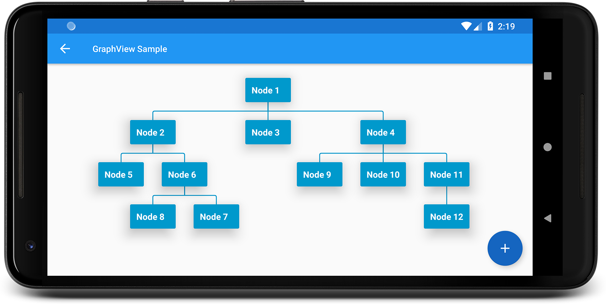
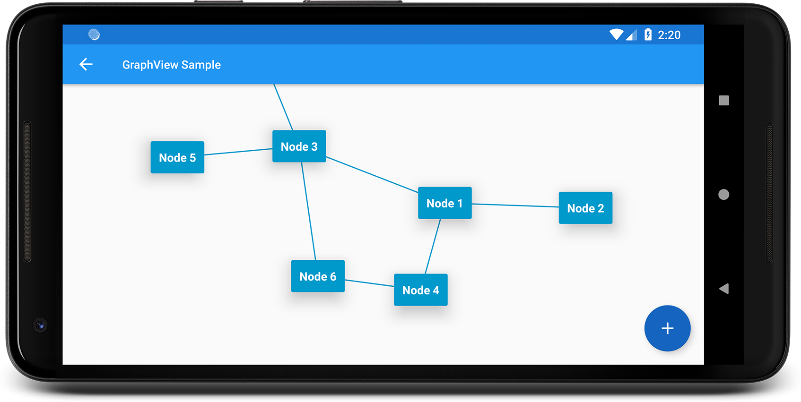
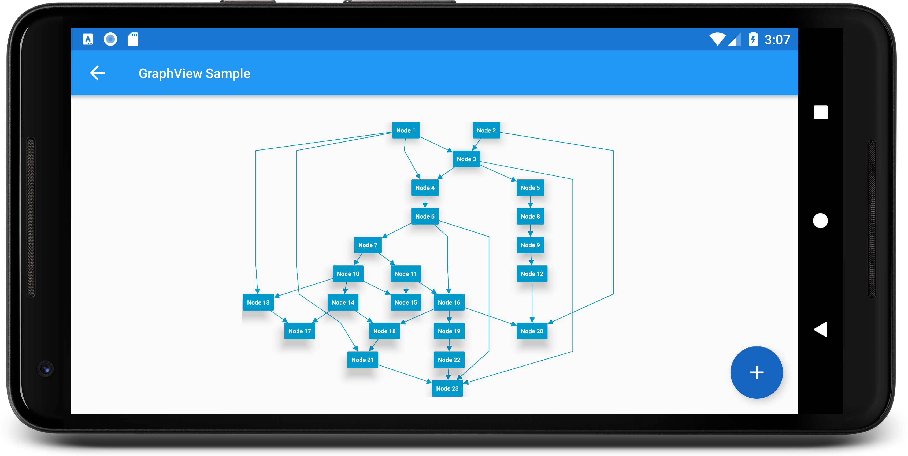

**Note: This library is in an early stage of development. There will be breaking changes to the public API until the first stable version is released.**

GraphView
===========

Android GraphView is used to display data in graph structures.


Overview
========
The library is designed to support different graph layouts.

Download
========

```groovy
dependencies {
    implementation 'de.blox:graphview:0.6.0'
}
```
Layouts
======
### Tree
Uses Walker's algorithm with Buchheim's runtime improvements (`BuchheimWalkerAlgorithm` class). Supports different orientations. All you have to do is using the `BuchheimWalkerConfiguration.Builder.setOrientation(int)` with either `ORIENTATION_LEFT_RIGHT`, `ORIENTATION_RIGHT_LEFT`, `ORIENTATION_TOP_BOTTOM` and
`ORIENTATION_BOTTOM_TOP` (default). Furthermore parameters like sibling-, level-, subtree separation can be set.
### Directed graph
Directed graph drawing by simulating attraction/repulsion forces. For this the algorithm by Fruchterman and Reingold (`FruchtermanReingoldAlgorithm` class) was implemented (currently works only for small graphs).
### Layered graph
Algorithm from Sugiyama et al. for drawing multilayer graphs, taking advantage of the hierarchical structure of the graph (`SugiyamaAlgorithm` class). You can also set the parameters for node and level separation using the `SugiyamaConfiguration.Builder`.

Usage
======

```xml
<LinearLayout
    android:layout_width="match_parent"
    android:layout_height="match_parent">
    <de.blox.graphview.GraphView
     android:id="@+id/graph"
     android:layout_width="match_parent"
     android:layout_height="match_parent">
    </de.blox.graphview.GraphView>
</LinearLayout>
```
You can make the node Layout how you like. Just define a layout file, e.g. ```node.xml``` ...
```xml
<android.support.v7.widget.CardView xmlns:android="http://schemas.android.com/apk/res/android"
                                    xmlns:card_view="http://schemas.android.com/apk/res-auto"
                                    android:id="@+id/card_view"
                                    android:layout_width="match_parent"
                                    android:layout_height="wrap_content"
                                    android:layout_gravity="center"
                                    android:layout_margin="5dp"
                                    card_view:cardBackgroundColor="@android:color/holo_blue_dark"
                                    card_view:cardElevation="16dp"
                                    card_view:contentPadding="10dp">

    <LinearLayout
        android:layout_width="match_parent"
        android:layout_height="match_parent"
        android:orientation="vertical">

        <TextView
            android:id="@+id/textView"
            android:layout_width="wrap_content"
            android:layout_height="wrap_content"
            android:textColor="@android:color/white"
            android:textStyle="bold"/>

    </LinearLayout>
</android.support.v7.widget.CardView>
```

... and use it with the adapter

```java
public class MainActivity extends AppCompatActivity {
    private int nodeCount = 1;

    @Override
    protected void onCreate(Bundle savedInstanceState) {
        super.onCreate(savedInstanceState);
        setContentView(R.layout.activity_main);
        GraphView graphView = findViewById(R.id.graph);

        // example tree
        final Graph graph = new Graph();
        final Node node1 = new Node(getNodeText());
        final Node node2 = new Node(getNodeText());
        final Node node3 = new Node(getNodeText());
        final Node node4 = new Node(getNodeText());
        final Node node5 = new Node(getNodeText());
        final Node node6 = new Node(getNodeText());
        final Node node8 = new Node(getNodeText());
        final Node node7 = new Node(getNodeText());
        final Node node9 = new Node(getNodeText());
        final Node node10 = new Node(getNodeText());
        final Node node11 = new Node(getNodeText());
        final Node node12 = new Node(getNodeText());

        graph.addEdge(node1, node2);
        graph.addEdge(node1, node3);
        graph.addEdge(node1, node4);
        graph.addEdge(node2, node5);
        graph.addEdge(node2, node6);
        graph.addEdge(node6, node7);
        graph.addEdge(node6, node8);
        graph.addEdge(node4, node9);
        graph.addEdge(node4, node10);
        graph.addEdge(node4, node11);
        graph.addEdge(node11, node12);

        // you can set the graph via the constructor or use the adapter.setGraph(Graph) method
        final BaseGraphAdapter<ViewHolder> adapter = new BaseGraphAdapter<ViewHolder>(graph) {
        
            @NonNull
            @Override
            public ViewHolder onCreateViewHolder(ViewGroup parent, int viewType) {
                final View view = LayoutInflater.from(parent.getContext()).inflate(R.layout.node, parent, false);
                return new SimpleViewHolder(view);
            }

            @Override
            public void onBindViewHolder(ViewHolder viewHolder, Object data, int position) {
                ((SimpleViewHolder)viewHolder).textView.setText(data.toString());
            }
        };
        graphView.setAdapter(adapter);
        
        // set the algorithm here
        final BuchheimWalkerConfiguration configuration = new BuchheimWalkerConfiguration.Builder()
                .setSiblingSeparation(100)
                .setLevelSeparation(300)
                .setSubtreeSeparation(300)
                .setOrientation(BuchheimWalkerConfiguration.ORIENTATION_TOP_BOTTOM)
                .build();
        adapter.setAlgorithm(new BuchheimWalkerAlgorithm(configuration));
    }
    
    private String getNodeText() {
        return "Node " + nodeCount++;
    }
}
```

Your ViewHolder class should extend from ViewHolder:
```java
class SimpleViewHolder extends ViewHolder {
    TextView textView;

    SimpleViewHolder(View itemView) {
        super(itemView);
        textView = itemView.findViewById(R.id.textView);
    }
}
```

Customization
=============

To use the custom attributes you have to add the namespace first: ```
    xmlns:app="http://schemas.android.com/apk/res-auto"```

| Attribute        | Format    | Example                        | Explanation|
|------------------|-----------|--------------------------------|------------|
| lineThickness   | Dimension | 10dp                           | Set how thick the connection lines should be
| lineColor       | Color     | "@android:color/holo_red_dark" | Set the color of the connection lines
| useMaxSize      | Boolean   | true                           | Use the same size for each node

Each of the attributes has a corresponding setter in the GraphView class, if you want to use it programmatically.

GraphView internally uses [ZoomLayout](https://github.com/natario1/ZoomLayout)  for its zoom feature. To change the zoom values just use the different attributes described in the ZoomLayout project site.

Examples
========
#### Rooted Tree


#### Directed Graph


#### Layered Graph


License
=======

    Copyright 2019 Team-Blox

    Licensed under the Apache License, Version 2.0 (the "License");
    you may not use this file except in compliance with the License.
    You may obtain a copy of the License at

       http://www.apache.org/licenses/LICENSE-2.0

    Unless required by applicable law or agreed to in writing, software
    distributed under the License is distributed on an "AS IS" BASIS,
    WITHOUT WARRANTIES OR CONDITIONS OF ANY KIND, either express or implied.
    See the License for the specific language governing permissions and
    limitations under the License.